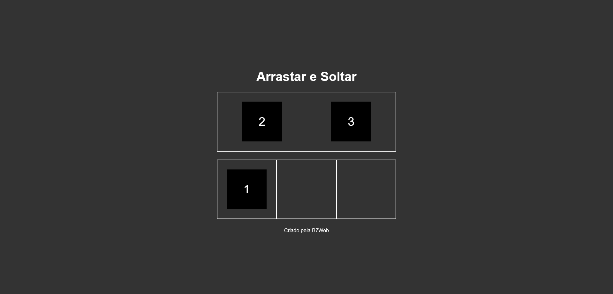

# Simple drag and drop aplication using JavaScript, created by B7Web

## Overview

### Screenshot

### Links

-   Solution URL: Working on it.

## My process

### Built with

-   Semantic HTML5 markup
-   CSS custom properties
-   JavaScript

### What I learned

In this project i could use JavaScript features to develop a simple drag and drop system to organize items. Project created by B7Web.

## Author

-   GitHub - Vinícius dos Santos Verissimo (https://github.com/viniciusdsv93)
